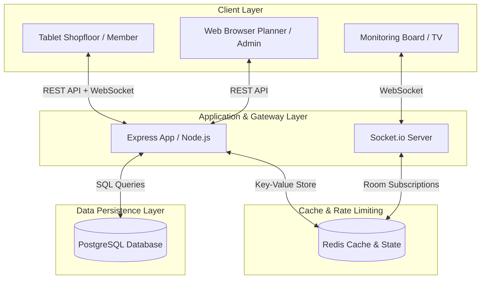
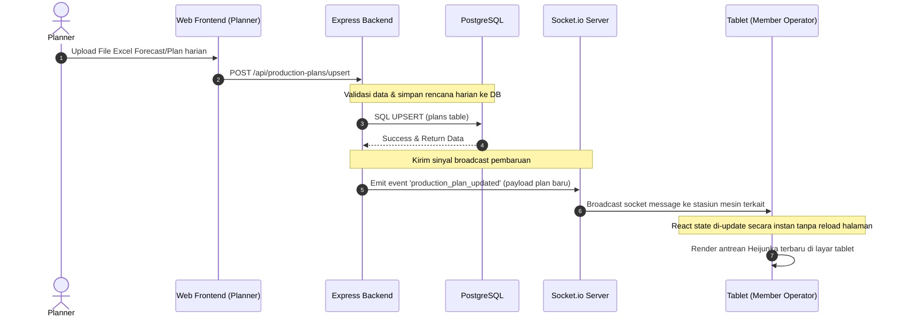

# Arsitektur & Alur Data

Halaman ini menjelaskan rancangan arsitektur sistem **Sugity Production Planning** secara menyeluruh serta bagaimana data didistribusikan secara dinamis antara berbagai komponen backend dan frontend.

---

## Desain Arsitektur 3-Tier

Sistem ini mengadopsi arsitektur 3-Tier yang dimodifikasi dengan dukungan sinkronisasi real-time:

---

## Aliran Data Sinkronisasi Real-Time (Data Flow)

Alur utama pendistribusian rencana harian mesin (*Heijunka*) hingga eksekusi produksi fisik pada tablet mengikuti tahapan berikut:

### Penjelasan Langkah Aliran Data:
1.  **Planner** mengunggah berkas Excel berisi forecast bulanan atau susunan jadwal harian melalui menu perencanaan di browser.
2.  Frontend mengirim berkas atau data JSON ke endpoint `POST /api/production-plans`.
3.  Backend melakukan validasi data dan menyimpannya ke tabel rencana produksi PostgreSQL dengan skema `UPSERT` (Insert atau Update jika data untuk tanggal & mesin tersebut sudah ada).
4.  Setelah database berhasil diperbarui, backend memicu *event emitter* di server Socket.io.
5.  Server Socket.io mem-broadcast pesan ke seluruh tablet stasiun kerja mesin yang sedang terhubung dan berada di dalam *channel/room* mesin tersebut.
6.  Tablet di area pabrik menerima data terbaru secara real-time, mendeteksi perubahan, memutar bunyi alert jika antrean kerja berubah, dan membarui daftar antrean kerja (*Heijunka*) di layar secara instan.

---

## Caching & Pengamanan dengan Redis

Redis diintegrasikan ke dalam arsitektur backend untuk menjamin skalabilitas horizontal dan meningkatkan respon API dengan fungsi berikut:

### 1. Caching Konfigurasi Tema (`site-config`)
Warna tema aplikasi (primary, secondary, navbar) bersifat dinamis dan dapat diubah oleh Super Admin dari panel admin.
*   **Alur**: Saat frontend memanggil `GET /api/site-config` (bersifat publik sebelum login), backend pertama kali mencari konfigurasi di Redis. Jika ada, data langsung dikembalikan. Jika tidak, data dibaca dari Postgres, lalu ditulis ke Redis dengan TTL 60 detik.
*   **Invalidasi**: Jika Super Admin memperbarui konfigurasi via `PUT /api/site-config`, cache warna di Redis langsung dihapus secara instan agar perubahan segera diterapkan oleh seluruh klien.

### 2. Caching Peran dan Akses (`rbac`)
Setiap kali request yang membutuhkan autentikasi dikirim ke backend, middleware `requireRole` memeriksa izin peran user.
*   Untuk menghindari query tabel `roles` dan `users` secara terus menerus, daftar role di-cache di Redis dengan masa aktif (TTL) 60 detik.

### 3. Rate Limiting login & verifikasi PIN
Untuk mencegah serangan *brute force* pada PIN operator mesin atau password akun:
*   Membatasi percobaan login hingga maksimal 5 kali kegagalan per 60 detik per alamat IP menggunakan library `rate-limiter-flexible` yang terhubung langsung ke Redis.

---

*Selanjutnya, mari jelajahi detail fungsionalitas dari sisi pengguna di folder [Dokumentasi Fitur Login](./login/overview.md).*
