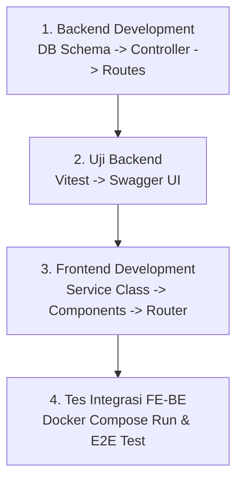

# Alur Penambahan Fitur Baru (End-to-End)

Halaman ini menyediakan panduan langkah demi langkah bagi developer untuk menambahkan fitur baru ke dalam codebase monorepo ini, mulai dari backend hingga frontend.

---

## Alur Implementasi Fitur Baru

Untuk memastikan konsistensi dan integritas data, ikuti alur 4 tahap berikut secara berurutan:



---

## Rincian Setiap Tahapan

### Tahap 1: Backend Development
1.  **Database Migration & Schema**:
    *   Jika fitur baru membutuhkan penyimpanan data baru, tambahkan definisi DDL SQL baru ke dalam berkas `backend/src/database/migrations/init.sql`.
    *   Jalankan query DDL secara manual pada Docker DB lokal untuk memperbarui skema Anda.
2.  **Buat Folder Modul**:
    *   Buat folder baru di bawah `backend/src/modules/your-feature/`.
3.  **Implementasikan Kode 4-Layer**:
    *   **Repository (`*.repository.ts`)**: Implementasikan query SQL mentah menggunakan pooling database.
    *   **Service (`*.service.ts`)**: Tulis validasi logic, error handling, dan manipulasi data.
    *   **Controller (`*.controller.ts`)**: Baca `req.body` atau `req.query`, panggil service, dan kirim output JSON.
    *   **Routes (`*.routes.ts`)**: Daftarkan endpoint URL, tambahkan Swagger JSDoc, dan sisipkan middleware otorisasi peran seperti `requireRole('super-admin')`.
4.  **Registrasi Modul**:
    *   Buka file `backend/src/app.ts` dan daftarkan routing modul baru Anda ke dalam Express middleware stack.

### Tahap 2: Uji Backend (Testing)
1.  **Unit & Integration Test**:
    *   Buat berkas uji baru di folder `backend/tests/integration/` untuk menguji endpoint HTTP secara otomatis menggunakan Vitest dan Supertest.
    *   Jalankan pengujian menggunakan perintah:
        ```bash
        npm run test
        ```
2.  **Verifikasi Manual via Swagger**:
    *   Nyalakan server development backend (`npm run dev`).
    *   Buka browser ke `http://localhost:3000/api/docs`.
    *   Coba panggil endpoint baru Anda secara manual menggunakan tombol **Try it out** untuk memastikan skema JSON response sesuai ekspektasi.

### Tahap 3: Frontend Development
1.  **Buat Folder Fitur**:
    *   Buat folder baru di bawah `frontend/src/features/your-feature/`.
2.  **Tulis Logika Fitur (OOP)**:
    *   Di dalam folder `context/` atau `services/`, buat berkas `YourFeatureService.ts`.
    *   Implementasikan panggilan API Axios (`api.get`, `api.post`) di dalam kelas layanan tersebut dan ekspor instansi singleton-nya.
3.  **Tulis Elemen Visual (UI)**:
    *   Buat halaman utama di bawah folder `pages/` (misal `YourFeaturePage.tsx`).
    *   Buat potongan sub-komponen UI pendukung di bawah folder `components/`.
    *   Gunakan React Query (`useQuery` / `useMutation`) untuk mengelola loading state, caching, dan invalidasi data API dari backend.
4.  **Registrasi Rute**:
    *   Buka `frontend/src/App.tsx`, impor halaman baru Anda, dan daftarkan path rute-nya.
    *   Bungkus rute baru tersebut dengan komponen `ProtectedRoute` dan set parameter `allowedRoles` untuk mengunci akses dari peran ilegal.

### Tahap 4: Tes Integrasi FE-BE (E2E)
1.  Nyalakan seluruh sistem lokal (Docker Compose Database + Backend server + Frontend server).
2.  Lakukan simulasi pengoperasian penuh di browser: login ke dalam stasiun kerja, lakukan interaksi UI, pastikan data tersimpan aman ke database PostgreSQL, serta pastikan sinyal real-time Socket.io memicu pembaruan data secara instan di layar TV Monitoring Board.

---

*Langkah berikutnya adalah mempelajari panduan deployment di [Setup Lokal Development](../deployment/local-dev.md).*
