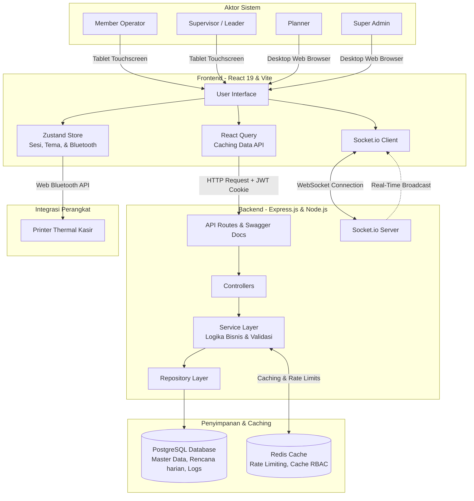

# Pengantar & Gambaran Umum

Selamat datang di Portal Dokumentasi Resmi **Sugity Production Planning & Shopfloor Execution**. Sistem ini dirancang khusus untuk memantau performa harian mesin-mesin injeksi dan mengontrol jalannya produksi (*execution*) pada area pabrik (shopfloor) secara real-time di PT. Sugity Creatives.

---

## Deskripsi Singkat Sistem

Sistem ini berfungsi sebagai jembatan informasi antara departemen perencanaan (*Planning*) dan aktivitas fisik di area pabrik (*Shopfloor Execution*). Melalui sistem ini, jadwal produksi harian (*Heijunka*) yang telah dirancang dapat didistribusikan secara langsung ke tablet masing-masing stasiun mesin. 

Sistem secara ketat memantau proses cetak label Kanban (mencegah fraud cetak label sebelum waktunya menggunakan *Print Lock*), melacak kuantitas produksi aktual, mencatat abnormalitas mesin, dan menghitung visualisasi beban mesin (*FUKA*).

---

## Pengguna Utama Sistem

Aplikasi ini dirancang dengan antarmuka yang disesuaikan untuk empat peran utama berikut:

1.  **Member Operator**
    *   Pengguna utama di sisi stasiun mesin menggunakan tablet Android.
    *   Fokus pada melihat jadwal heijunka harian, memulai/menjeda pekerjaan, mengonfirmasi kuantitas hasil produksi, melakukan pelaporan abnormality/NG, dan mencetak label Kanban secara fisik.
2.  **Supervisor (Leader)**
    *   Bertanggung jawab atas kontrol kualitas dan kelancaran stasiun kerja.
    *   Fokus pada penanganan abnormality/NG di lapangan, melakukan verifikasi dan *sign-off* menggunakan PIN Leader untuk membuka kembali sistem tablet yang terkunci akibat masalah produksi.
3.  **Planner**
    *   Pengelola jadwal dan perencanaan kapasitas produksi jangka menengah.
    *   Fokus pada pengunggahan data forecast Excel bulanan/harian, menyusun urutan antrean heijunka, memantau *timeline* secara keseluruhan, serta mengelola master part & konversi Sebango.
4.  **Super Admin**
    *   Pengelola administrasi sistem secara menyeluruh.
    *   Mengatur otorisasi pengguna berbasis peran (RBAC), memantau log sistem (*audit trail*), mengelola data master pabrik & mesin, serta menyesuaikan skema warna tema portal secara instan.

---

## Tech Stack Utama

Aplikasi ini dikembangkan dengan teknologi modern demi performa, keamanan, dan keandalan tinggi:

| Bagian | Teknologi | Keterangan |
| :--- | :--- | :--- |
| **Frontend UI** | React 19 + TypeScript | Library UI terbaru dengan performa unggul. |
| **Build & Tooling** | Vite | Bundler super cepat untuk development dan build statis. |
| **Styling** | Tailwind CSS v4 | Utilitas styling dengan `@tailwindcss/vite` compiler. |
| **State Client** | Zustand (v5) | Manajemen state global yang ringan untuk sesi, tema, dan Bluetooth. |
| **State Server** | React Query (v5) | Caching dan sinkronisasi otomatis data REST API dari backend. |
| **Realtime Sync** | Socket.io Client (v4) | Sinkronisasi status mesin dan update jadwal produksi secara instan. |
| **Hardware Link** | Web Bluetooth API + `nosleep.js` | Koneksi printer kasir bluetooth langsung dari browser tablet & penjaga layar tetap menyala. |

---

## Skema Arsitektur Sistem

Berikut adalah gambaran umum bagaimana komponen-komponen sistem berinteraksi:

*(Diagram di atas menunjukkan aliran REST API & WebSocket antara Web Browser/Tablet, Express Backend, Database PostgreSQL, Caching Redis, serta Web Bluetooth ke Printer Fisik)*

---

*Untuk memulai penjelajahan teknis arsitektur aliran data, silakan lanjutkan membaca ke halaman [Arsitektur & Alur Data](./architecture.md).*
