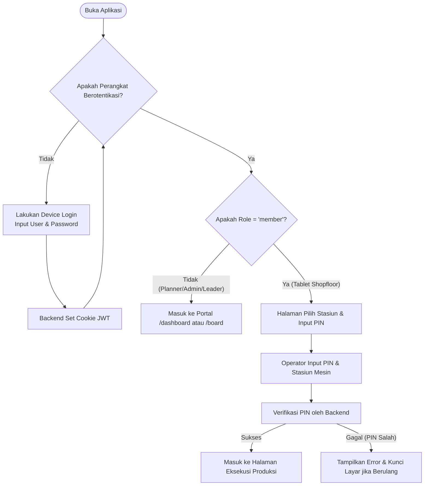

# Tinjauan Umum Alur Login

Untuk mengamankan akses sistem perencanaan produksi di lingkungan pabrik, Sugity Production Planning menggunakan skema **autentikasi bertingkat** (Multi-level Authentication) yang terbagi menjadi dua gerbang masuk utama:

1.  **Device Login (Otorisasi Perangkat/Browser)**
2.  **Member Machine Login (Pilih Stasiun Kerja & Masukkan PIN)**

---

## Mengapa Alur Bertingkat Digunakan?

Pada area produksi (shopfloor), sebuah tablet Android sering kali dipasang permanen pada stasiun mesin tertentu dan digunakan bergantian oleh beberapa operator lintas shift kerja. 
*   **Keamanan Token**: Device Login memastikan browser pada tablet tersebut terdaftar secara resmi di backend dan mendapatkan token akses (JWT).
*   **Kemudahan Operator**: Operator tidak perlu mengetikkan alamat email dan password yang panjang saat berganti shift. Mereka cukup memilih nama stasiun kerja mereka dan memasukkan 4-6 digit PIN operator secara cepat di layar.

---

## Aliran Proses Log Masuk (Login Flow)

Berikut adalah diagram alur proses login dari sudut pandang perangkat tablet shopfloor:

---

*Untuk mempelajari konfigurasi dan detail langkah Device Login, silakan buka halaman [Login Perangkat](./device-login.md).*
